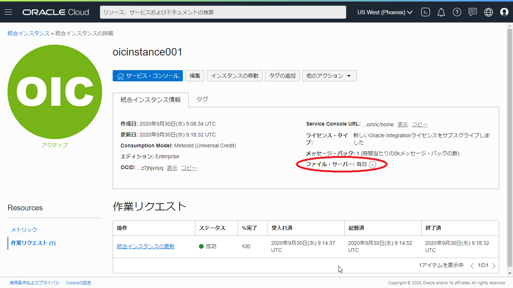
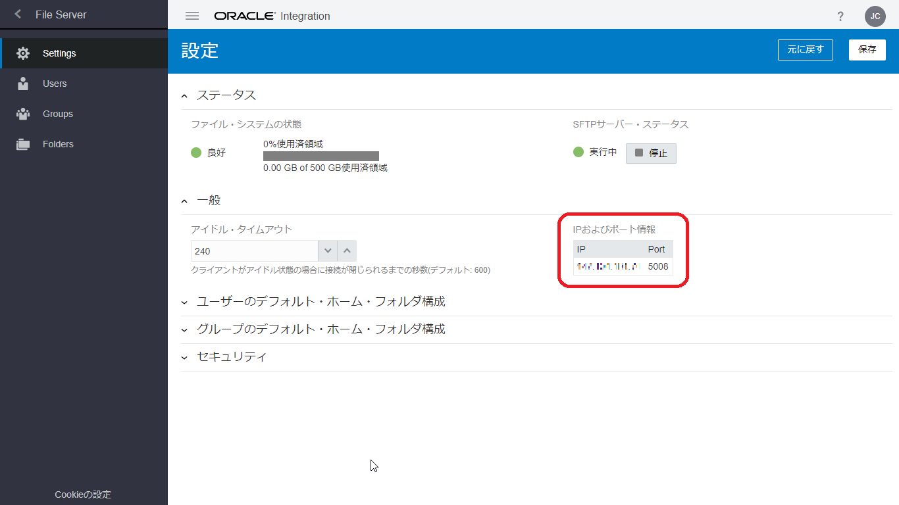

# Oracle Integration Cloud チュートリアル - ファイル・サーバーの有効化

2020年10月

このチュートリアルは、Oracle Integration Cloud が提供する SFTP に対応したファイル・サーバーを有効化する手順について説明します。

## 前提

このチュートリアルでは、Oracle Integration Cloud のインスタンスがすでに作成されていることを前提としています。
Oracle Integration Cloud のインスタンスをまだ作成していない場合は、次のページを参考に作成してください。

> **[Oracle Integration Cloud インスタンスの作成](https://community.oracle.com/docs/DOC-1037470)**  
> Oracle Integration(OIC) を使い始めるための準備作業として、OIC インスタンスの作成が必要になります。
> この文書は OIC インスタンスの作成方法を ステップ・バイ・ステップで紹介するチュートリアルです

## ファイル・サーバーの有効化

Oracle Integration Cloud が提供している File Server は、インスタンスの作成直後は有効化されていません。
OCI コンソールを使用して、管理者が明示的に有効にする必要があります。

1.  OCI コンソールにログインします。
    サブスクライブしているリージョンの URL を使用します。

    - Tokyo リージョン: [https://console.ap-tokyo-1.oraclecloud.com/](https://console.ap-tokyo-1.oraclecloud.com/)
    - Osaka リージョン: [https://console.ap-osaka-1.oraclecloud.com/](https://console.ap-osaka-1.oraclecloud.com/)
    - Ashburn リージョン: [https://console.us-ashburn-1.oraclecloud.com/](https://console.us-ashburn-1.oraclecloud.com/)
    - Phoenix リージョン: [https://console.us-phoenix-1.oraclecloud.com/](https://console.us-phoenix-1.oraclecloud.com/)

    

1.  OCI コンソールの画面左上にあるハンバーガー・メニューをクリックし、 **「ソリューションおよびプラットフォーム」** カテゴリにある **「アプリケーション統合」** → **「統合」** をクリックします。

    

1.  OCI コンソールの画面左側のリストから、Oracle Integration Cloud のインスタンスを作成したコンパートメントを選択します。

    

    選択したコンパートメント内に作成されている Oracle Integration Cloud のインスタンスの一覧が表示されるので、ファイル・サーバーを有効化するインスタンスの名前のリンクをクリックします。

1.  Oracle Integration Cloud インスタンスの詳細ページが表示されます。
    **「統合インスタンス情報」** のボックスで、 **「ファイル・サーバー」** の **「有効化」** リンクをクリックします。

    

1.  ファイル・サーバーを有効化してもよいかを確認するメッセージ・ボックスが表示されます。
    **「有効化」** ボタンをクリックします。

    

1.  ファイル・サーバーを有効化する処理が開始されたことを表すメッセージが表示されます。
    また、Oracle Integration Cloud のインスタンスのステータスが **「更新中」** に変更されます。

    

1.  ファイル・サーバーの有効化処理が終了すると、**「統合インスタンス情報」** の **「ファイル・サーバー」** が **「有効」** と表示されます。
    また、Oracle Integration Cloud のインスタンスのステータスは **「アクティブ」** に変更されます。

    

## ファイル・サーバーの動作環境の確認

ファイル・サーバーが有効化されたら、動作環境を確認します。

1.  Oracle Integration Cloud のサービス・コンソールにログインします。
    OCI コンソールで Oracle Integration Cloud インスタンスの詳細ページを開いている場合は、 **「サービス・コンソール」** ボタンをクリックします。

    

1.  画面左上のハンバーガ・メニュー・アイコンをクリックします。
    画面左側に表示されるナビゲーション・ペインで、**「設定」** をクリックします。

    

    **「設定」** メニューから **「File Server」** を選択します。

    

    **「File Server」** メニューから **「Settings」** を選択します。

    

1.  Integration Cloud のファイル・サーバーに関する設定が表示されます。
    **「一般」** セクションの **「IPおよびポート情報」** で、ファイル・サーバーが稼働している IP アドレスとポート番号を確認することができます。

    

## ファイル・サーバーにアクセスするユーザーの有効化

Oracle Integration Cloud のファイル・サーバーにアクセスするユーザーは、明示的に有効にする必要があります。

### 公開鍵認証のための鍵ペアの作成

このステップはオプションです。

Oracle Integration Cloud が提供するファイル・サーバーは、初期状態では、次の2種類の認証方式が使用できます:

- パスワード認証
- 公開鍵認証

パスワード認証は、Oracle Integration Cloud のサービス・コンソールにログインする時と同じユーザー名とパスワードを使用してファイル・サーバーにログインします。

公開鍵認証を使用するためには、`ssh-kegen` ツールを使用して、鍵ペアを作成します。
Windows 10 では PowerShell、 macOS ではターミナルを起動して、次のようなコマンドを実行します。

```sh
ssh-keygen -t rsa -b 2048 -C "OIC File Server" -f id_rsa_oic
```

コマンドを実行すると、パスフレーズの入力を促されるので、必要に応じて指定してください（パスフレーズが不要な場合は、そのまま Enter キーを押します）。

これによって、次の２つのファイルが生成されます:

- `id_rsa_oic` -- 非公開鍵ファイル
- `id_rsa_oic.pub` -- 公開鍵ファイル

### ユーザーの有効化

1.  Oracle Integration Cloud のサービス・コンソールにログインします。
    すでにファイル・サーバーの **「設定」** ページを開いている場合は、ナビゲーション・ペインで **「Users」** をクリックします。

    **「ホーム」** ページからは、ナビゲーション・ペインで **「設定」** → **「File Server」** → **「Users」** をクリックしてください。

1.  **「ユーザー」** ページが表示され、 Oracle Integration Cloud にアクセス可能なユーザーの一覧が表示されます。

    

1.  アクセスを有効化したいユーザーにマウス・ポインタを合わせると表示される、鉛筆のアイコン（**「構成」** アイコン）をクリックします。

    

1.  画面の右側に、選択したユーザーの SFTP アクセスのプロパティが表示されます。
    画面右上のスイッチがオンになっていることを確認します。

    

1.  【このステップはオプションです】 公開鍵認証のための鍵ペアを生成済みの場合は、 **「認証公開キー」** のアップロード・アイコンをクリックして、公開鍵ファイル（`*.pub` ファイル）をアップロードします。

1.  プロパティの画面の右上にある閉じるアイコンをクリックします。
    **「ユーザー」** 画面で、選択したユーザーが構成済みと表示され、ホーム・フォルダが設定されていることを確認します。

    

### 動作確認

SFTP のクライアント・ツール（FileZillaなど）または、Windows の PowerShell や macOS のターミナルを使用して、Oracle Integration Cloud のファイル・サーバーにアクセスしてみましょう。

CLI ツールを使用してファイル・サーバーにアクセスする場合は、次のように入力します。

**ユーザー名/パスワードを使用する場合:**

```sh
sftp -P <ポート番号> <ユーザー名>@<IPアドレス>
```

**公開鍵認証を使用する場合:**

```sh
sftp -P <ポート番号> -i <非公開鍵ファイル> <ユーザー名>@<IPアドレス>
```
